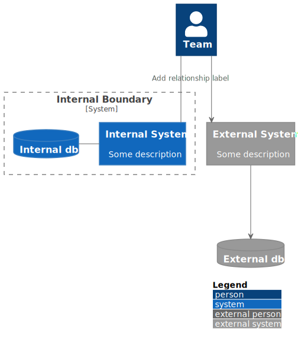

# PlantUML-Demo

## Install the PlantUML extension for VS Code.

Name: PlantUML
Id: jebbs.plantuml
Description: Rich PlantUML support for Visual Studio Code.
Version: 2.16.0
Publisher: jebbs
VS Marketplace Link: https://marketplace.visualstudio.com/items?itemName=jebbs.plantuml

## Install Graphviz

`brew install graphviz`
https://graphviz.gitlab.io/download/

## C4

The descriptions below are pulled from the official C4 website https://c4model.com/

`Level 1: A System Context diagram provides a starting point, showing how the software system in scope fits into the world around it.`

`Level 2: A Container diagram zooms into the software system in scope, showing the high-level technical building blocks.`

`Level 3: A Component diagram zooms into an individual container, showing the components inside it.`

`Level 4: A code (e.g. UML class) diagram can be used to zoom into an individual component, showing how that component is implemented.`

